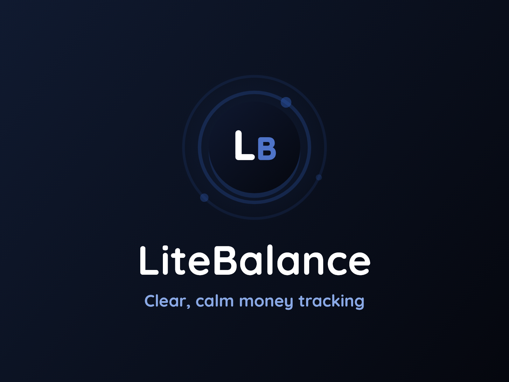
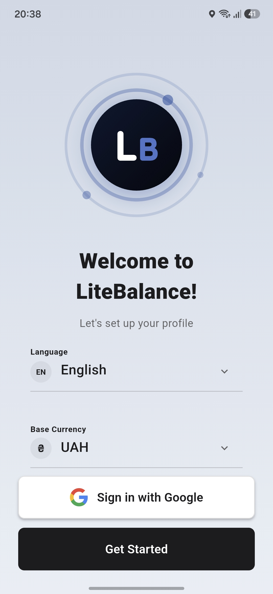
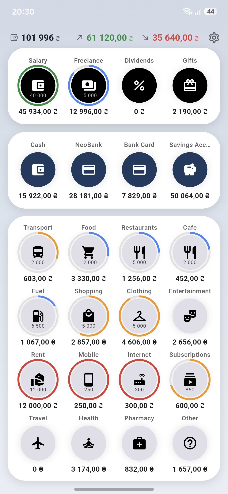
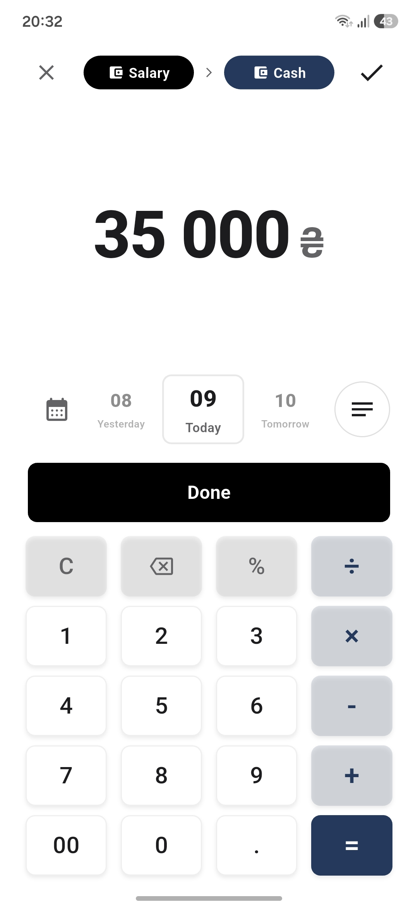
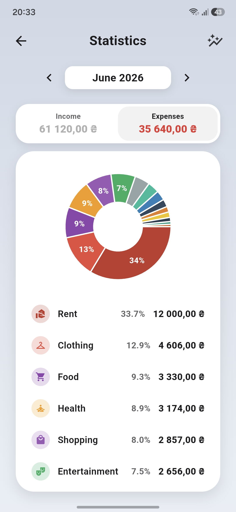
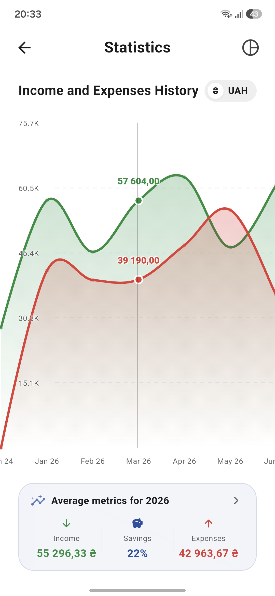
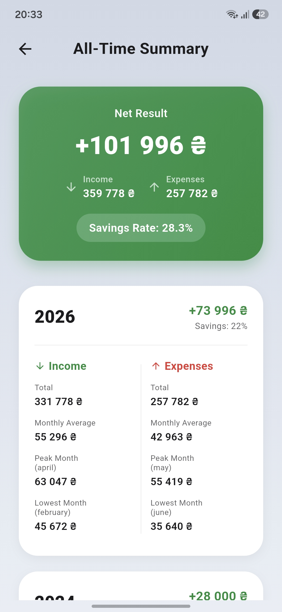
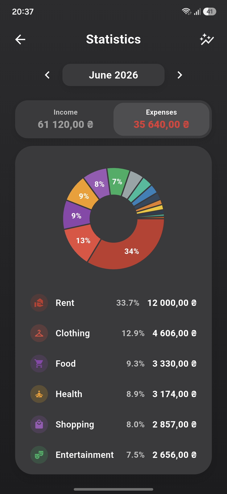
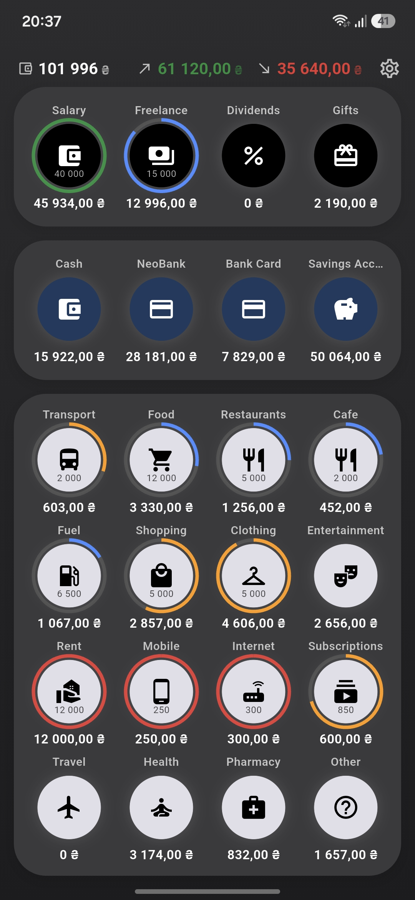

<p align="center">
  
</p>

<h1 align="center">LiteBalance</h1>

<p align="center">
  <b>Clear, calm money tracking.</b><br/>
  A modern, offline-first personal finance app built with Flutter.
</p>

<p align="center">
  
  
  
  
  
  
  
</p>

---

## ✨ Overview

**LiteBalance** turns everyday money tracking into a calm, clear ritual. Log income and
expenses, manage accounts and categories, keep an eye on subscriptions, and watch your
trends — all in a polished, animated UI. Your data lives **on your device** (offline-first
SQLite), with optional encrypted backups and Google Drive sync.

## 🚀 Features

- 💸 **Transactions** — income, expenses and transfers between accounts
- 🗂️ **Categories & accounts** — custom icons, colors and per-category budgets
- 🌍 **Multi-currency** — **93 currencies** with live exchange rates and historical conversion, picked from searchable currency & language sheets (filter by name or ticker)
- 🔁 **Subscriptions** — recurring payments with flexible periods and auto-pay
- 📊 **Statistics** — income/expense history, monthly trends and all-time summary (fl_chart)
- 🗑️ **Trash** — 30-day soft delete with restore
- 🔄 **Import / Export** — CSV import with a guided column mapper, CSV export
- ☁️ **Backups** — encrypted local `.cfbak` files **and** Google Drive sync
- 🔐 **Security** — PIN code and biometric / Face ID lock, with a configurable auto-lock delay
- 🎨 **Themes** — refined light & dark modes with a cohesive design system
- 🌐 **50 languages** — full localization incl. right-to-left (Arabic, Hebrew, Persian, Urdu); see below
- 📴 **Offline-first** — everything works without a connection

## 🖼️ Screenshots

<table>
  <tr>
    <td align="center"><br/><sub>Onboarding</sub></td>
    <td align="center"><br/><sub>Home</sub></td>
    <td align="center"><br/><sub>Transactions</sub></td>
    <td align="center"><br/><sub>Statistics</sub></td>
  </tr>
  <tr>
    <td align="center"><br/><sub>Trends</sub></td>
    <td align="center"><br/><sub>Breakdown</sub></td>
    <td align="center"><br/><sub>Statistics · Dark</sub></td>
    <td align="center"><br/><sub>Dark mode</sub></td>
  </tr>
</table>

## 🌐 Localization

50 languages, fully translated (UI + all 93 currency names, sourced from Unicode CLDR):

**Europe**
🇺🇦 Українська · 🇬🇧 English · 🇩🇪 Deutsch · 🇵🇱 Polski · 🇪🇸 Español · 🇫🇷 Français ·
🇮🇹 Italiano · 🇵🇹 Português · 🇳🇱 Nederlands · 🇹🇷 Türkçe · 🇨🇿 Čeština · 🇷🇴 Română ·
🇭🇺 Magyar · 🇸🇰 Slovenčina · 🇬🇷 Ελληνικά · 🇧🇬 Български · 🇸🇪 Svenska · 🇩🇰 Dansk ·
🇫🇮 Suomi · 🇭🇷 Hrvatski · 🇦🇱 Shqip · 🇧🇦 Bosanski · 🇷🇸 Српски · 🇲🇰 Македонски

**Asia & Pacific**
🇨🇳 简体中文 · 🇯🇵 日本語 · 🇰🇷 한국어 · 🇮🇩 Bahasa Indonesia · 🇲🇾 Bahasa Melayu ·
🇻🇳 Tiếng Việt · 🇵🇭 Filipino · 🇹🇭 ไทย · 🇮🇳 हिन्दी · 🇧🇩 বাংলা · 🇳🇵 नेपाली ·
🇱🇰 සිංහල · 🇲🇲 မြန်မာ · 🇰🇭 ខ្មែរ · 🇱🇦 ລາວ · 🇲🇳 Монгол · 🇰🇿 Қазақ ·
🇦🇿 Azərbaycan · 🇦🇲 Հայերեն · 🇬🇪 ქართული

**Africa**
🇰🇪 Kiswahili · 🇪🇹 አማርኛ

**Right-to-left (RTL)**
🇸🇦 العربية · 🇮🇱 עברית · 🇮🇷 فارسی · 🇵🇰 اردو

RTL locales mirror the whole interface; amounts stay left-to-right and the calendar's
first day of week follows each locale (Mon / Sun / Sat). Translations live in
[`assets/translations/`](assets/translations) (one JSON per locale, powered by
[`easy_localization`](https://pub.dev/packages/easy_localization)).

## 🛠️ Tech Stack

| Area | Choice |
|---|---|
| Framework | Flutter (Dart 3.11) |
| State management | Riverpod 3 |
| Local database | drift (SQLite) |
| Localization | easy_localization (50 locales, incl. RTL) |
| Charts | fl_chart |
| Security | local_auth + flutter_secure_storage (encrypted) |
| Cloud backup | google_sign_in + googleapis (Drive) |
| Exchange rates | Fawazahmed currency-api |
| Animations | flutter_animate |

## 🏁 Getting Started

### Prerequisites
- Flutter SDK (Dart `^3.11`)
- Android Studio / Xcode for device builds

### Run

```bash
flutter pub get
flutter run
```

### Build

```bash
flutter build apk        # Android
flutter build ios        # iOS
```

### Tests & analysis

```bash
flutter analyze
flutter test --concurrency=2
```

## 🎨 Branding assets

The logo, launcher icon and splash are generated from a single Flutter widget
([`AppLogo`](lib/widgets/common/app_logo.dart)) — no external design files.

```bash
# Regenerate PNG assets in assets/branding/ from AppLogo
flutter test tool/render_logo.dart

# Regenerate launcher icons & native splash from those assets
dart run flutter_launcher_icons
dart run flutter_native_splash:create
```

## 📁 Project Structure

```
lib/
├── main.dart                # App entry, theme & localization setup
├── models/                  # Data models (e.g. AppCurrency)
├── database/                # drift database & DAOs
├── providers/               # Riverpod providers
├── services/                # Backup, export/import, auth, currency repo
├── screens/                 # Feature screens
├── widgets/common/          # Design system (AppLogo, AppDialog, AppSnackbar, …)
├── theme/                   # Colors, light/dark themes
└── utils/                   # Helpers (haptics, formatters, constants)
assets/
├── translations/            # 50 locale JSON files
├── fonts/                   # Quicksand (OFL)
└── branding/                # Logo / icon / splash source PNGs
```

## 🔒 Privacy

LiteBalance is **offline-first**. All financial data is stored locally in an on-device
SQLite database. Cloud backup to Google Drive and Google sign-in are **optional** and only
used when you explicitly enable them. Local backups can be **password-encrypted**.

Full details: [Privacy Policy](PRIVACY.md).

## 📄 License

© 2026 LiteBalance. **All rights reserved.**

This is proprietary software. The source is published for reference/portfolio purposes
only — you may not use, copy, modify or distribute it without explicit written permission.
The Quicksand font is licensed separately under the
[SIL Open Font License](assets/fonts/Quicksand-OFL.txt).

See also: [Privacy Policy](PRIVACY.md).

---

<p align="center"><sub>Made with Flutter · LiteBalance</sub></p>
